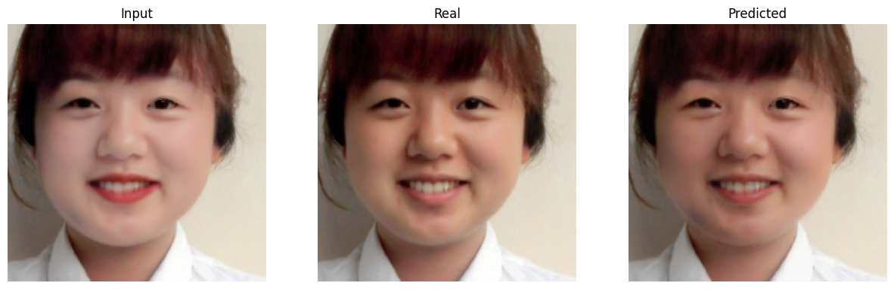
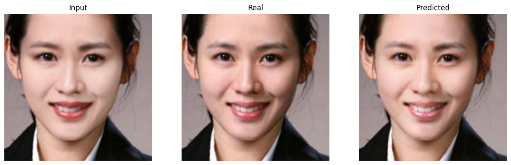

# **De-makeup Transfer**

**1.** Using Makeup Transfer model to transform non-makeup to makeup image.Then use these 2 images to do data de-makeup (input: photo
makeup and the output is an image without makeup). (train=1000, val=100, test=100)

**2.** Build model : Unet

**Unet architecture**

- Pretrained Netwrok for Encoder (Resnet 50, ...)
- Decoder

**3.** Loss function: Perceptual Loss

## **Data**

**Makeup & non-makeup** : [Link](https://drive.google.com/file/d/18UlvYDL6UGZ2rs0yaDsSzoUlw8KI5ABY/view)

**De-makeup data** : [Link](https://drive.google.com/file/d/1-8gPduhJo3_YULqqhGJDutbLmwQoBOgq/view?usp=sharing)

## **Results**

## **Reference**

https://www.facebook.com/aivietnam.edu.vn/

https://github.com/VinAIResearch/CPM

https://github.com/thaoshibe/awesome-makeup-transfer
